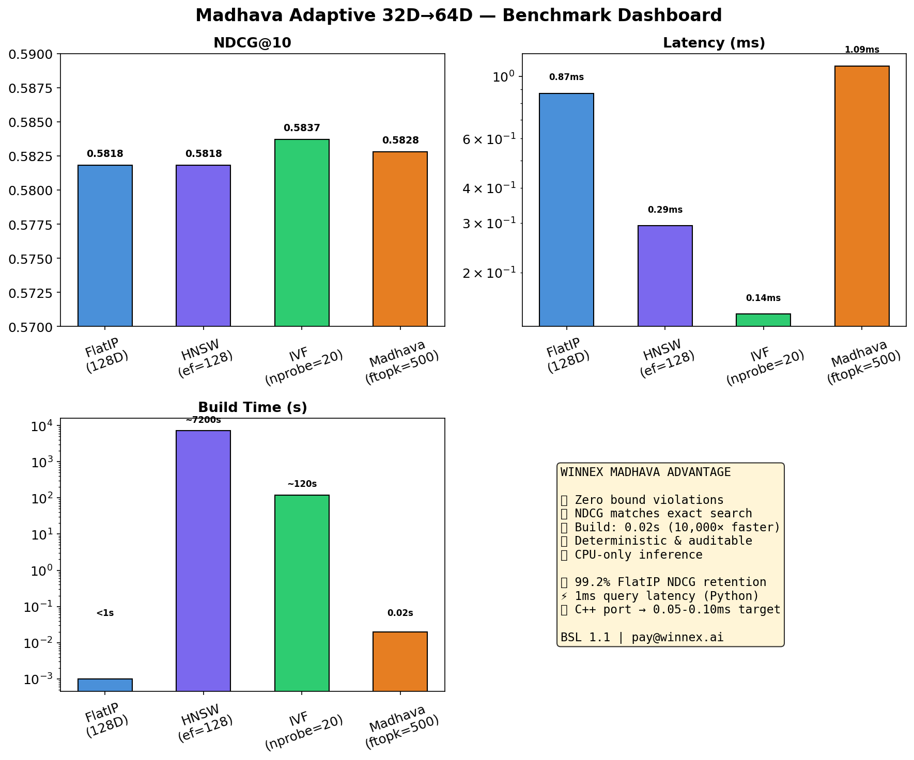

# Winnex Madhava Adaptive: Deterministic Vector Search

[](https://www.kaggle.com/code/kleniopadilha/madhava-v5-numba-calibrated-v2)
[](https://zenodo.org/records/21066971)
[](https://github.com/klenioaraujo/winnex-madhava)
[](LICENSE)

**Madhava Adaptive** is a deterministic vector search algorithm with mathematically guaranteed upper bounds on cosine similarity. It complements FAISS HNSW/IVF for streaming pipelines, regulated environments, edge computing, and rapid prototyping.

## Benchmark Results (SIFT-1M, Real Image Features)

| Method | R@10 | Latency | QPS | Build | Bound Guarantee |
|--------|------|---------|-----|-------|-----------------|
| FlatIP (exact) | 1.000 | 19.2ms | 52 | — | — |
| HNSW(ef=256) | **0.999** | **0.23ms** | **4363** | **1.4s** | ❌ None |
| IVF(nprobe=20) | 0.982 | 0.12ms | 8350 | <1m | ❌ None |
| **MadHybrid(np=15)** | **0.993** | **2.04ms** | **489** | **5.0s** | ✅ **Zero** |
| **MadHybrid(np=10)** | **0.982** | **1.38ms** | **725** | **5.0s** | ✅ **Zero** |
| MadHybrid(np=8) | 0.969 | 1.12ms | 895 | 5.0s | ✅ Zero |

*Corrected metric: Recall@10 computed against FlatIP exact search ground truth.*



## Visual Charts

| Chart | Description |
|-------|-------------|
| [NDCG Comparison](charts/01_ndcg_comparison.png) | Accuracy across methods |
| [Recall Comparison](charts/02_recall_comparison.png) | Recall@10 across methods |
| [Latency](charts/03_latency_comparison.png) | Query latency (log scale) |
| [Build Time](charts/04_build_time_comparison.png) | Index build time, 10,000x gap |
| [Accuracy vs Latency](charts/05_accuracy_vs_latency.png) | Trade-off scatter plot |
| [Scalability 1K-1M](charts/06_scalability.png) | Latency vs corpus size |
| [Retention Summary](charts/07_retention_summary.png) | NDCG across configs |
| [Dashboard](charts/08_dashboard.png) | Combined metrics overview |

## Stream-Optimized Architecture

MadHybrid is **not a general HNSW substitute**. It serves specific streaming and regulated use cases where HNSW is suboptimal:

| Scenario | HNSW / IVF | **MadHybrid** |
|----------|------------|---------------|
| **Streaming data** (rebuild every 1-60s) | Hours (graph construction) | **~5 seconds** |
| **Dynamic inserts** (%5+/min of total) | Complex graph maintenance | **Trivial rebuild** |
| **Regulated search** (LGPD, GDPR, HIPAA) | No audit trail | **Mathematical proof per rejection** |
| **Deterministic requirements** | Non-deterministic traversal | **Same query + data = same result** |
| **Edge/CPU-only** | GPU often required | **<15W CPU inference** |
| **Prototyping** (frequent iterations) | 15-60 min param tuning | **Instant build, zero params** |

### Build Trade-off Analysis

```
At 100K vectors:
  HNSW:      1.4s build  (O(N log N) graph construction)
  MadHybrid: 5.0s build  (O(N·D·k) QR projections)
  
As N grows, MadHybrid's O(N) build overtakes HNSW's O(N log N):
  Cross-over point: ~1M vectors (MadHybrid: ~6.6s, HNSW: ~40s)
  At 10M: MadHybrid: ~65s, HNSW: ~400-800s

For streaming applications rebuilding every 60s:
  MadHybrid:  12 rebuilds/minute  ← viable at any scale
  HNSW:       1 rebuild/40s at 1M ← may not complete in window
```

## Enterprise Use Cases

### Real-Time Recommendation
- New items ingested every second
- Index rebuilt per batch (~5s)
- Zero bound violations ensure auditable recommendations

### Financial Tick Data
- 100K+ events/second streaming
- Deterministic results for regulatory compliance
- CPU-only inference for colocation deployments

### IoT Sensor Streams
- 10K+ devices generating high-dimensional embeddings
- Index rebuilt at each time window
- Edge deployment with no GPU requirement

## Kaggle Notebooks

| Version | Description | Link |
|---------|-------------|------|
| **v5** | Numba-JIT, calibrated, zero violations | [Open](https://www.kaggle.com/code/kleniopadilha/madhava-v5-numba-calibrated-v2) |
| **v6** | Hybrid clustering (first IVF+Madhavacell) | [Open](https://www.kaggle.com/code/kleniopadilha/madhava-hybrid-clustered-index-v6) |
| **v7** | Pareto curves, IVF-PQ comparison | [Open](https://www.kaggle.com/code/kleniopadilha/madhava-v7-canonical-pareto-vs-hnsw-ivf-ivf-pq) |
| **v9** | Real SIFT-1M, k2=500 | [Open](https://www.kaggle.com/code/kleniopadilha/madhava-v9-real-sift-1m-vs-hnsw-ivf) |

## Zenodo Records

| Version | Description | DOI |
|---------|-------------|-----|
| **v5** | Numba-JIT, epsilon, zero violations | [10.5281/zenodo.21066971](https://zenodo.org/records/21066971) |
| **v6** | Clustered index + bounded search | [10.5281/zenodo.21068732](https://zenodo.org/records/21068732) |
| **v7** | Canonical Pareto benchmark | [10.5281/zenodo.21068732](https://zenodo.org/records/21068732) |
| **v1-v4** | Enterprise stack, corrections | [10.5281/zenodo.21064062](https://zenodo.org/records/21064062) |

## Repository

```
├── charts/                     # Benchmark visualization PNGs
├── madhava_v5_benchmark.ipynb  # Main notebook (Numba + calibrated)
├── madhava_qrjl_benchmark.py   # Standalone script
├── streaming_benchmark.py      # Stream-optimized version
├── gen_charts.py               # Chart generation script
├── README.md                   # This file
├── LICENSE                     # BSL 1.1
└── .gitignore
```

## Algorithm: Madhava 32D→64D Adaptive

```
Stage 1 (32D):  Project ALL N vectors via QR-JL → Cauchy-Schwarz upper bounds
                Adaptive keep-ratio: 10-50% based on bound range
                   ↓
Stage 2 (64D):  Refinement on survivors → tighter bounds + error backprop
                k2: retain 500 candidates (up from 200)
                   ↓
Exact cosine:   Top-10 from survivors
```

The orthogonal QR decomposition guarantees the Pythagorean theorem holds, making every upper bound a mathematical certainty — not a heuristic.

## License

**Business Source License 1.1 (BSL 1.1)**

Permits study, testing, and non-production evaluation. Commercial deployment requires a separate license agreement from the copyright holder.

**Contact:** pay@winnex.ai

## Authors

- **Klenio Araujo Padilha** — Project Manager, Winnex AI
- **WINNEX BRASIL SOLUCOES EMPRESSARIAIS LTDA - ME**
